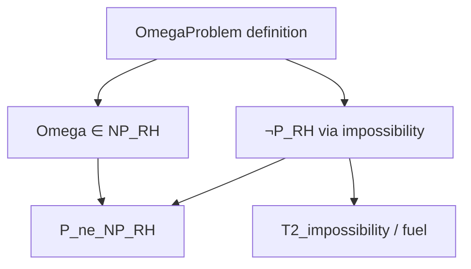

# P≠NP Internal Separation — Implementation Plan (v2)

## Goal

Prove `P_ne_NP_RH` internally in the RevHalt operative framework:
```lean
∃ (P : NatProblem), NP_RH P.val ∧ ¬ P_RH P.val
```

## Key Insight (Corrected)

**Cook-Levin / SAT NP-completeness is NOT required.**
We only need ONE problem in NP_RH that's not in P_RH.

**Gap theorem gives linear bound (t ≥ n), not super-polynomial.**
So `gap_subpoly` won't work. We need **impossibility/undecidability** via `T2_impossibility` / `fuel` lemmas.

---

## Strategy: Direct Omega Approach

### Phase 1: Define Omega-based Problem

Define a `NatProblem` encoding: "Does program p halt within t steps?"
or equivalently: "Is the n-th bit of Ω equal to b?"

```lean
/-- Halting problem instance: (p, t, b) = "program p halts in ≤t steps with result b" -/
def HaltingInstance := ℕ × ℕ × Bool

/-- NatProblem encoding via pairing function. -/
def OmegaProblem : NatProblem := ...
```

### Phase 2: Prove OmegaProblem ∈ NP_RH

The witness is a **trace prefix** that demonstrates halting.

```lean
def omegaVerifier : PolyVerifier OmegaProblem.val := {
  VΓ := ...  -- context encoding the trace
  Vφ := ...  -- "trace halts with expected bit"
  wBound := fun n => n  -- witness = trace of length ≤ n
  ...
  correct := ∀ x, Solves OmegaProblem x ↔ ∃ w, ... HaltsBy ...
}

theorem Omega_in_NP : NP_RH OmegaProblem.val := ⟨omegaVerifier, trivial⟩
```

### Phase 3: Prove ¬P_RH via Impossibility

**Key lemma**: A `PolyDecider` for OmegaProblem would give a total decider for halting.

```lean
/-- From PolyDecider, extract a halting oracle. -/
lemma decider_gives_halting (D : PolyDecider OmegaProblem.val) :
    ∀ p t, Decidable (HaltsIn p t) := ...

/-- But halting is undecidable (via T2_impossibility / fuel). -/
theorem halting_undecidable : ¬ ∀ p t, Decidable (HaltsIn p t) := ...

/-- Therefore no PolyDecider exists. -/
theorem Omega_not_in_P : ¬ P_RH OmegaProblem.val := by
  intro ⟨D, _⟩
  exact halting_undecidable (decider_gives_halting D)
```

### Phase 4: Final Theorem

```lean
theorem P_ne_NP_internal : P_ne_NP_RH :=
  ⟨OmegaProblem, Omega_in_NP, Omega_not_in_P⟩
```

---

## Dependencies



---

## Existing Code to Reuse

- `T2_impossibility` in `Theory/Limits.lean` or similar
- `fuel` / `impossibility` lemmas
- `OmegaChaitin.lean` for Omega-related primitives

---

## Status

- [x] Phase 0: Framework (PNP.lean, etc.)
- [ ] Phase 1: OmegaProblem definition
- [ ] Phase 2: Omega ∈ NP_RH
- [ ] Phase 3: ¬P_RH proof
- [ ] Phase 4: Final theorem

---

## SAT NP-Completeness (Separate Project)

If desired later, can prove SAT NP-complete internally:
1. Define `SATP_canonical` with `SATSemantics`
2. Build `CookLevinBuilder`
3. Derive `NPComplete_RH SATP`

But this is **not required** for `P_ne_NP_RH`.
