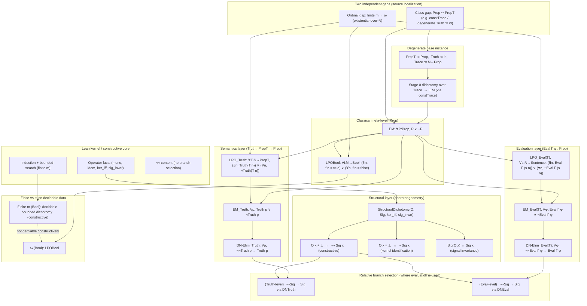

# Dependency Architecture

This document shows the complete dependency structure of RevHalt, separating the constructive core from evaluation layers.

## Full Dependency Graph

## Key Observations

1. **Constructive Core (K)**: All operator facts (`up_mono`, `up_idem`, `up_eq_bot_iff`, `exists_up_iff`) live here with 0 axioms.

2. **Two Independent Gaps (G)**:
   - **Class gap**: `Prop ↪ PropT` — yields EM when you can encode arbitrary propositions
   - **Ordinal gap**: finite → ω — yields LPO on decidable data

3. **Layered Evaluation**:
   - `EM_Truth` / `LPO_Truth` — semantic level
   - `EM_Eval` / `LPO_Eval` — operational level (what an evaluator can decide)

4. **Branch Selection is Relative**: The passage from `¬¬Sig` to `Sig` can be resolved at different levels (Truth or Eval), depending on which layer you're working in.

5. **Degenerate Instance**: `RevHalt/Base` is the special case where `PropT := Prop` and `Truth := id`, which collapses everything to the meta-level EM.
