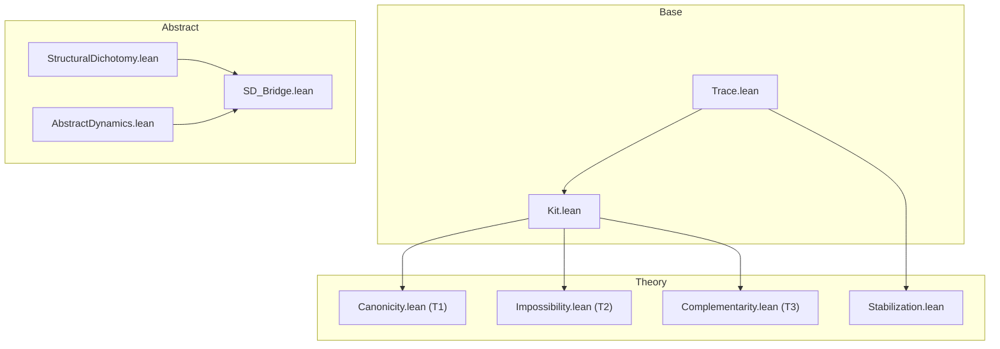

# RevHalt: Overview

RevHalt is a Lean 4 formalization that reframes the halting dichotomy as a
structural operator problem. The core claim is not that halting is decidable,
but that a specific structural regime (a closure-like operator with a kernel
and signal invariance) yields a canonical, non-arbitrary dichotomy once the
side is externally given.

The project has three layers:

- Base: traces, halting, and the `up` operator.
- Theory: T1/T2/T3 theorems (canonicity, impossibility, complementarity).
- Abstract: a schema (`StructuralDichotomy`) and a parametric navigation
  dynamics (`PickWorld`) independent of Trace/up.

Contributions (formalized):

1) A structural criterion for dichotomies
   `StructuralDichotomy` gives a formal criterion for calling a dichotomy
   structural (rather than purely extensional) in this setting. This separates
   the role of classical reasoning (deciding the side) from the role of
   structure (forcing the certificate content).

2) Canonical behavior of reverse halting kits
   Under a weak monotonicity detection hypothesis, any kit collapses to
   standard halting (T1), and no uniform internal predicate can decide it (T2).

3) Parametric navigation dynamics
   Given any external oracle of picks, the chain/limit construction is sound
   and admits a closed form. Under fair schedules, the limit is
   schedule-independent and equals a canonical omega state (T3-style dynamics),
   without dependence on Trace/up.

Scope and limits:

- P vs NP is only a conceptual criterion in comments, not a formalization.
- The oracle that picks the side is external; the formalism shows that once the
  side is given, the certificate is forced by structure (no choice needed).

Pointers:
- Base: `RevHalt/Base/Trace.lean`, `RevHalt/Base/Kit.lean`
- T1/T2/T3: `RevHalt/Theory/Canonicity.lean`,
  `RevHalt/Theory/Impossibility.lean`, `RevHalt/Theory/Complementarity.lean`
- Schema + instantiation: `RevHalt/Theory/StructuralDichotomy.lean`
- Parametric dynamics: `RevHalt/Theory/AbstractDynamics.lean`
- Bridge (SDOracle → PickWorld): `RevHalt/Theory/SD_Bridge.lean`

## Dependency Graph

